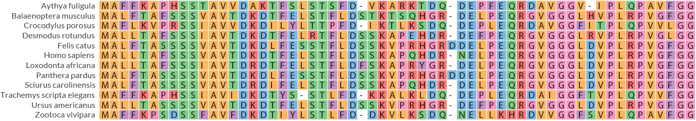

## Description

**MSA4u** is a simple visualisation tool for Multiple Sequence Alignments.

**Programming language:** Python3   
**OS:** MacOS, Linux  
**Python dependencies:** biopython, configs, argparse, reportlab  
**OS-level dependencies:** mafft (v. 7.490 is included in the package)   
**License:** СС0  
**Version:** 0.4.0 (January 2023)


## Installation

- The most stable release of msa4u can be installed directly from pypi:

```
python3 -m pip install msa4u
```

- The development version is available at github :

```
git clone https://github.com/GCA-VH-lab//msa4u.git
cd msa4u
python3 -m pip install --upgrade pip
python3 -m pip install wheel
python3 setup.py sdist bdist_wheel
python3 -m pip install -e .
```

**!** If you're a linux user, run `msa4u --linux` post-install command once to update paths in the premade config files that set by default for MacOS users.

## Quickstart guide

Here we present several examples of msa4u vizualisations.
The necessary data samples are provided by msa4u at the post-install step:  
`msa4u --data` 

### Command-line interface

#### Aligmnent and visualisation.

You can use a fasta file with unaligned sequences as input. In this case, msa4u will use mafft to align your sequences (*with --auto parameter:* *`mafft --auto input.fa`*) and then perform visualisation.  

`msa4u -fa msa4u_data/aa_sequences.fa`  

With default parameters you will get alignments file (*aa_sequences.aln.fa*) and pdf file with visualisaton (*[aa_sequences.pdf](docs/img/aa_sequences.pdf)*) in your working directory.  

#### Visualisation of a pre-made alignments file

You can use a pre-made alignments file as input with -aln parameter: 

`msa4u -aln aa_sequences.aln.fa -label description -o visualisation.pdf`

In this case we also used optional arguments: `-label` to set labels style (can be id, description or all - full header of sequences); and `-o` to set output file name.  
See help message for more detailed parameters description (`msa4u -h`)

**Output:**



---

### API

MSA4u has a simple API allowing it programmatic usage from within a Python program.  
Below we descrive several Python snippets that mimic results of command-line calls. 

#### Aligmnent and visualisation

```python3
import msa4u

parameters = msa4u.manager.Parameters()
unaligned_fasta_file = "msa4u_data/aa_sequences.fa"
fasta = msa4u.manager.Fasta(fasta=unaligned_fasta_file, parameters=parameters)
mafft_output = fasta.run_mafft()
msa = msa4u.manager.MSA(mafft_output, parameters)
msa.plot()
```
#### Visualisation of a pre-made alignments file.

```python3
import msa4u

parameters = msa4u.manager.Parameters()
parameters.arguments["label"] = "description"
parameters.arguments["output_filename"] = "visualisation.pdf"

alignments = "aa_sequences.aln.fa"
msa = msa4u.manager.MSA(alignments, parameters)
msa.plot()
```
   
## Reference

If you find msa4u useful, please cite [uorf4u paper](https://doi.org/10.1101/2022.10.27.514069). msa4u initially was developed as a sublibrary of uorf4u.     
Artyom. A. Egorov, Gemma C. Atkinson, **uORF4u: a tool for annotation of conserved upstream open reading frames**, *bioRxiv 2022.10.27.514069; doi: [10.1101/2022.10.27.514069](https://doi.org/10.1101/2022.10.27.514069)*


## Contact

Please contact us by e-mail _artem**dot**egorov**AT**med**dot**lu**dot**se_ or use Issues to report any technical problems.  

## Authors

mas4u is developed by Artyom Egorov at [the Atkinson Lab](https://atkinson-lab.com), Department of Experimental Medical Science, Lund University, Sweden. We are open for suggestions to extend and improve msa4u functionality. Please don't hesitate to share your ideas or feature requests.
